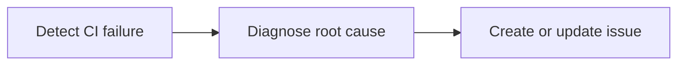

# 🏥 CI Doctor

> For an overview of all available workflows, see the [main README](../README.md).

**Automated CI failure investigator that diagnoses root causes and reports actionable recommendations**

The [CI Doctor workflow](../workflows/ci-doctor.md?plain=1) investigates failed GitHub Actions runs using job logs and repository context. It identifies the most likely root cause, recommends evidence-backed next steps, and consolidates recurring failures into an existing issue when possible.

## Installation

```bash
# Install the 'gh aw' extension
gh extension install github/gh-aw

# Add the workflow to your repository
gh aw add-wizard githubnext/agentics/ci-doctor
```

This walks you through adding the workflow to your repository.

## How It Works



The workflow starts with the earliest failed job and first meaningful error, then correlates the logs with the triggering commit, pull request, and workflow configuration. It adds new evidence to an open issue that reports the same root cause, or creates one structured investigation issue when the failure has actionable new information. It does not create an issue for cancelled runs, duplicate reports, or failures with no actionable new information.

## Usage

### Configuration

By default, the workflow monitors failures from the `CI` workflow on the `main` branch. Edit `on.workflow_run.workflows` and `on.workflow_run.branches` to match the target repository.

After editing, run `gh aw compile` and commit both the Markdown workflow and its generated lock file to the default branch.
