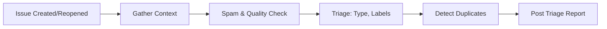

# 🏷️ Issue Triage

> For an overview of all available workflows, see the [main README](../README.md).

**Automatically triage issues when they are created or reopened**

The [Issue Triage workflow](../workflows/issue-triage.md?plain=1) runs when issues are created or reopened to analyze content, check related items, set issue type, add labels, detect duplicates, and post structured triage reports.

## Installation

```bash
# Install the 'gh aw' extension
gh extension install github/gh-aw

# Add the workflow to your repository
gh aw add-wizard githubnext/agentics/issue-triage
```

This walks you through adding the workflow to your repository.

## How It Works



The workflow reads the issue discussion, searches open and recent closed issues, and consults repository documentation when it helps clarify expected behavior or contribution requirements.

## Usage

This workflow triggers automatically when issues are created or reopened—you cannot start it manually.

### Configuration

The workflow includes an allowed set of type, priority, duplicate, spam, and information-request labels. Ensure those labels exist in the target repository, or edit the list and priority definitions to match the repository's conventions.

After editing, run `gh aw compile` and commit both the Markdown workflow and its generated lock file to the default branch.

### Human in the loop

- Review triage reports for accuracy
- Validate label, type, and field assignments
- Override or adjust triage decisions when needed
